# Entity-Relationship Diagram (ERD) - Signal AI Database Schema

This document describes the schema structure of Signal AI. The database uses SQLite for local development and Neon/Supabase Postgres in production.

```mermaid
erDiagram
    User ||--o{ Watchlist : "owns"
    User ||--o{ Portfolio : "owns"
    User ||--o| Settings : "has"
    User ||--o{ ChatHistory : "interacts"
    
    User {
        String id PK
        String email UK
        String passwordHash
        String name
        DateTime createdAt
        DateTime updatedAt
    }

    Watchlist {
        String id PK
        String name
        String userId FK
        String tickers
        DateTime createdAt
        DateTime updatedAt
    }

    Portfolio {
        String id PK
        String name
        String userId FK
        String assets
        Float allocation
        Float sharpeRatio
        Float volatility
        Float expectedReturn
        Float riskScore
        DateTime createdAt
    }

    Settings {
        String id PK
        String userId FK "UK"
        String apiKeyFields
        String limits
        DateTime createdAt
        DateTime updatedAt
    }

    ChatHistory {
        String id PK
        String userId FK
        String sessionName
        String messages
        DateTime createdAt
    }

    Stock {
        String id PK
        String ticker UK
        String name
        String sector
        String industry
        Float price
        Float change
        Float changePercent
        DateTime lastUpdated
    }

    Article ||--o| NewsSentiment : "analyzed_as"
    Article {
        String id PK
        String title
        String url UK
        String source
        DateTime publishedAt
        String content
        String ticker
    }

    NewsSentiment {
        String id PK
        String articleId FK "UK"
        String sentiment
        Float score
        String eventType
        DateTime createdAt
    }

    Signal {
        String id PK
        String ticker
        String recommendation
        Float confidence
        String riskLevel
        Float technicalScore
        Float sentimentScore
        Float fundamentalScore
        Float macroScore
        Float volatilityScore
        String reasoning
        DateTime createdAt
    }

    Backtest {
        String id PK
        String name
        String ticker
        Float cagr
        Float winRate
        Float maxDrawdown
        Float sharpeRatio
        String trainingWindowStart
        String trainingWindowEnd
        Int numSamples
        String metrics
        DateTime createdAt
    }

    SportsFixture ||--o{ Prediction : "predicts"
    SportsFixture {
        String id PK
        String sport
        String league
        String homeTeam
        String awayTeam
        DateTime eventDate
        String status
        Int homeScore
        Int awayScore
        String rawData
        DateTime createdAt
    }

    Prediction {
        String id PK
        String fixtureId FK
        String predictedWinner
        Float homeProb
        Float awayProb
        Float drawProb
        Float confidence
        String riskLevel
        Float precision
        Float recall
        Float f1Score
        Float calibrationScore
        Int numSamples
        String trainingWindow
        String reason
        Boolean outcomeMatched
        DateTime lastValidationDate
        DateTime createdAt
    }

    ModelMetric {
        String id PK
        String modelName
        String type
        Float precision
        Float recall
        Float f1
        Float calibration
        Int sampleCount
        DateTime lastValidationDate
        DateTime createdAt
    }

    EconomicEvent {
        String id PK
        String title
        String description
        DateTime eventDate
        String country
        Float actual
        Float forecast
        Float previous
        String impact
        String affectedSectors
        DateTime createdAt
    }

    APIUsage {
        String id PK
        String apiName
        String endpoint
        Int requestsUsed
        Int requestLimit
        String date
        DateTime createdAt
    }

    Log {
        String id PK
        DateTime timestamp
        String level
        String category
        String message
        String payload
    }
```

